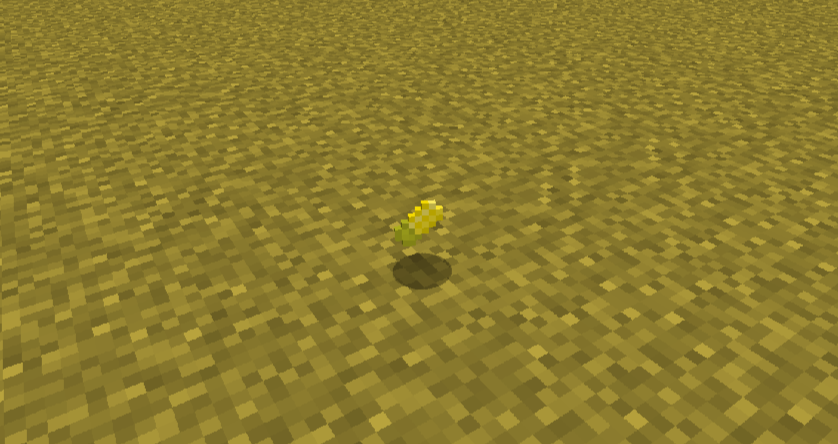
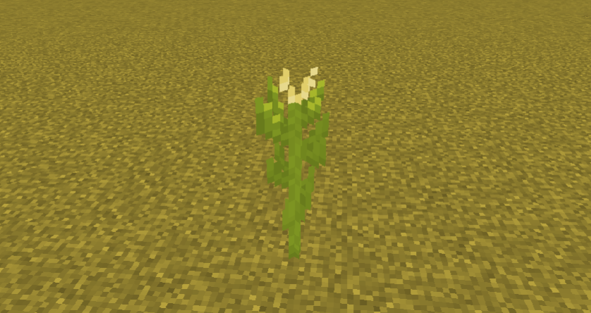
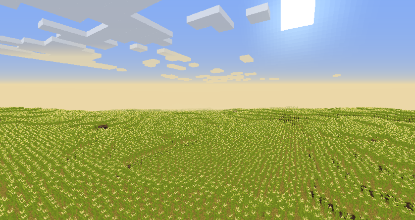

# Corntopia

A Minecraft mod that adds corn and corn related features.

## Installation
Corntopia is designed using Fabric and can be installed like any other Fabric mod.

1. If you have not already, install Fabric:
   
   https://fabricmc.net/wiki/install
2. You will also need the Fabric API:
   
   https://www.curseforge.com/minecraft/mc-mods/fabric-api
3. The Corntopia mod is provided through GitHub Releases:
   
   **https://github.com/cloewen8/Corntopia/releases**
   
   Try to pick a version that matches your Minecraft version. If a release for your version of Minecraft does not exist, try the newest release. If you experience any compatibility problems, please create a ticket:
   
   https://github.com/cloewen8/Corntopia/issues/new/choose

## Features (spoilers)
- **Corn** - An edible item, comparable to Sweet Berries.
  - Can be crafted into Corn Stalk (kernels).
  - Can be composted.

- **Corn Stalk** - A 2 tall sunflower-life block.
  - Drops corn when broken (even more with Fortune).
  - It burns incredibly easily (easier then any other vanilla block).

- **Popcorn** - Like corn but fluffy and snack sized.
  - You can make it by blowing up corn!
  - Does not restore hunger but does restore 1/4 saturation.
  - Can be eaten when full.

- **Corn Field** - A flat yellowish-orange biome that is overgrown with corn!

## Contributing
__Contributions welcome!__

The best way you can contribute is by providing your unique perspective in [discussions](https://github.com/cloewen8/Corntopia/discussions) and [issues](https://github.com/cloewen8/Corntopia/issues). If you want to contribute more directly, consider creating a [pull request](https://github.com/cloewen8/Corntopia/compare).

- Be respectful and avoid destructive comments.
- Don't use offensive language, including swear words and hate speech.

### Issues
If you experience any problems using the mod, consider creating an issue. Examples include:

- If you suspect the mod caused Minecraft to crash.
- If a feature is not working as expected.
- If a feature is missing.

### Pull requests
A pull request allows you to directly make changes to the mod.

- Changes could include (but are not limited to): Adding new features, fixing bugs, adding translations, and tweaking textures.
- It is heavily recommended you open a discussion ahead of time discussing your changes. This helps me and the rest of the community to coordinate our efforts.
- Keep writing (code and documentation) consistent.
- You should test your changes and create test cases when possible. All tests must pass before the pull request is accepted. I will manually test all pull requests when possible.
- Avoid adding features unrelated to corn.

## License
Copyright 2020 Colton Loewen

Licensed under the Apache License, Version 2.0. To summarize, this allows you to:

- Use the mod for personal use.
- Use the mod on your server.
- Add the mod to a mod-pack.
- Modify and redistribute your own version of the mod.

**As long as:**

- You provide the included license.
- You document any changes.

**This summary is not a substitute for the full license**, which is available in [LICENSE.md](https://github.com/cloewen8/Corntopia/blob/master/LICENSE.md).
